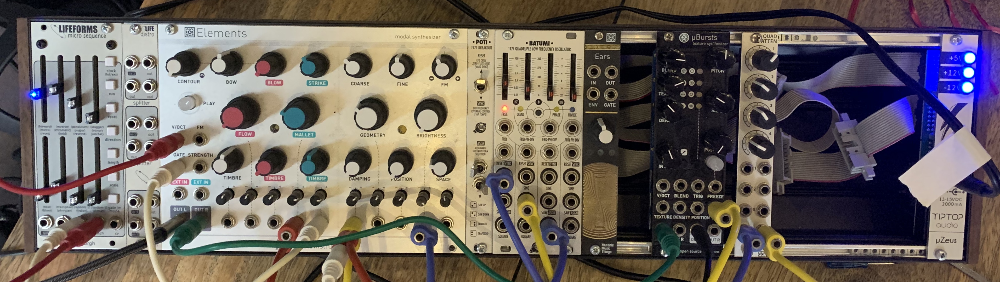

# Experiment with Elements and µBursts 2020-09-09

[Listen to experiment with Elements and Clouds Parasites (uBursts) 2020-09-09](http://yourlisten.com/mattable/elements-and-clouds-2020-09-09)

# Setup

## Lifeforms micro sequence

- tap `clock` to set rapid tempo
- set `length` to seven notes
    1. 10th
    2. 11th
    3. octave
    4. mute
    5. root
    6. octave
    7. mute
- connect `gate` out to Elements `GATE`
- connect `pitch` out to Elements `V/OCT`

## BATUMI 1974 Quadruple Low Frequency Oscillator
- connect 0.5Hz SINE to Elements `BRIGHTNESS` CV
    - Elements `BRIGHTNESS` full CCW (minimum)
    - `BRIGHTNESS` CV full CW (maximum)
- connect 0.05Hz SAW DOWN to:
    - Elements `DAMPING`
        - Elements `DAMPING` full CCW (minimum)
        - `DAMPING` CV at about 2 to 3 o'clock
    - Elements `MALLET`
        - Elements `MALLET` at 9 o'clock
        - `MALLET` CV at about 2 to 3 o'clock
    - Elements `STRIKE TIMBRE`
        - Elements `STRIKE TIMBRE` at 12 o'clock
        - `STRIKE TIMBRE` CV at about 2 to 3 o'clock

## Elements
- `CONTOUR` full CCW (minimum) for a tight sound
- `BOW` and `BOW TIMBRE` at 12 o'clock
- `BLOW` and `BLOW TIMBRE` at *almost* full CCW
- `STRIKE` and `STRIKE TIMBRE` at 12 o'clock
- `FLOW` at *almost* full CCW
- `COARSE` at 10 o'clock (controls pitch)
- `FINE` at 12 o'clock
- `FM` does not matter
- `GEOMETRY` at 10 o'clock (also affects pitch)
- `BRIGHTNESS` full CCW (sweeping with CV and want to maximize
  the range swept by CV)
- `POSITION` at 10 o'clock (affects overtones on pitch)
- `SPACE` at 9 o'clock (before 12 o'clock to avoid the
  *algorithmic reverberator*: do not want reverberation on the
  dry track)
- `OUT L` to mixer channel 1 (this is the voice at the beginning)

## Clouds Parasites
- `Resonestor mode`:
  <https://mqtthiqs.github.io/parasites/clouds.html#resonestor>
- `BLEND` sets:
    - Dry/wet fully CW (i.e., 5 o'clock) (this is wet as can be)
        - LED is red
    - Stereo spread about 4 o'clock
        - LED is redish-orange
    - Feedback amount fully CCW
        - LED is off
    - Reverberation about 3 o'clock
        - LED is orange
- `ELEMENTS` `OUT R` to `CLOUDS` `IN L`
- `CLOUDS` `OUT L` to mixer channel 2 (this is the voice that
  comes in around the 35-second mark)
- *slow* LFO from the `BATUMI`:
    - first Sine out, then switch to Square out
    - attenuate this LFO with the `WMD QUAD ATTEN`
    - attenuated LFO to `CLOUDS` `SIZE` CV
    - fiddle with `SIZE` and with the amount of attenuation to
      find a nice tonal range spanned by the Sine LFO

# Export mp3
- [x] upload to YourListen
